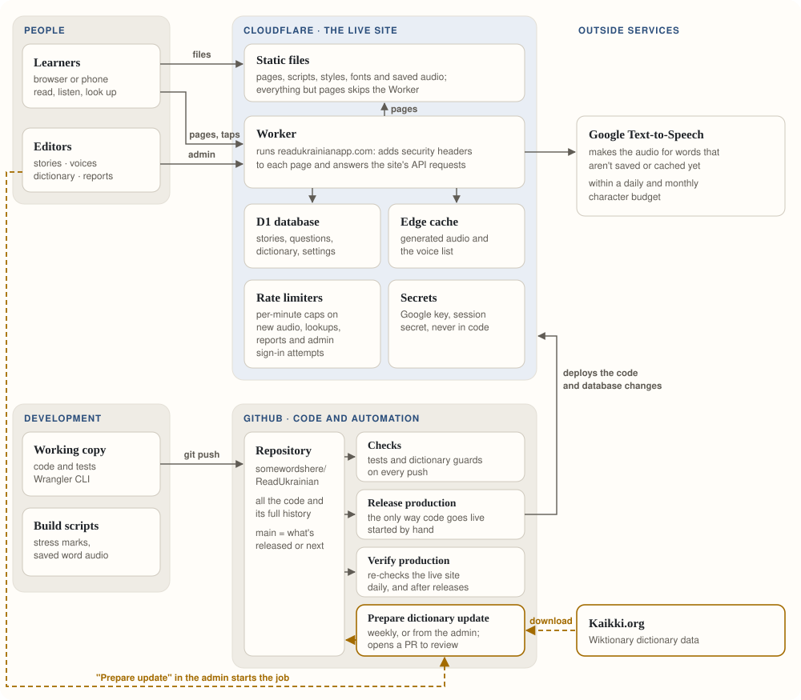

# 🇺🇦 Read Ukrainian

[Read Ukrainian](https://readukrainianapp.com) is a reading-practice website for learners who want to build confidence with Ukrainian through short stories, pronunciation support, and comprehension quizzes.

Live at [readukrainianapp.com](https://readukrainianapp.com) · Version 1.03 · [Change log](docs/change.log) · [Project status](docs/project-status.md)

## 📚 What readers can do

The library holds **127 stories**: 24 at A1 and 103 at A2. B1 is planned and stays hidden until it has real content. The interface is in Ukrainian on purpose, so readers stay immersed in the language; translations are offered in English, German and Polish.

### Find a story

- Browse the library by level, with word counts and progress shown on each story
- Search by title, topic or level, and filter by topic, bookmarks, or finished and unfinished stories
- Pick up where you left off with *Продовжити навчання*

### Read

- A focused reading layout set in Literata; on phones the questions follow the story
- Stress marks (*наголоси*) on story words, which can be switched off
- Tap or select a word to see its English, German or Polish translation and its Ukrainian grammar
- Hear the word with **Прослухати**, in the site's voice or another voice from the editors' shortlist, with a clear note that the voice is AI-generated
- Report a wrong translation straight from the word, for the editors to review
- A tip for first-time readers that points at a word they can tap

### Check understanding

- Five multiple-choice questions per story, with immediate feedback and answer order shuffled fairly
- Review mistakes, restart the quiz, or continue to the next story
- Quiz results, finished stories and bookmarks are saved in the browser, so no account is needed

Keyboard-friendly controls, visible focus states, accessible quiz choices and reduced-motion support are built in throughout. If the content service is temporarily unavailable, a bundled copy of the stories keeps reading working.

## ✍️ Content management

The website includes a private publishing workspace for the content team. Depending on their role, team members can:

- create and edit story drafts
- add, reorder, duplicate, and remove quiz questions
- preview unpublished changes
- publish or unpublish stories
- review and restore previous revisions
- audition the Google voices, shortlist the ones readers may choose from, and set the site's default voice
- see how much of the daily and monthly pronunciation budget has been used
- review learner reports about translations, and dictionary suggestions
- check dictionary coverage before publishing, and start a dictionary update

Drafts remain private until a publisher explicitly releases them, keeping work in progress separate from the public story library. Published stories reach readers within about a minute, without a code release.

## 🛠️ How it's built

<picture>
  <source media="(prefers-color-scheme: dark)" srcset="docs/architecture-dark.svg">
  
</picture>

- **Cloudflare Worker.** One Worker serves every page with its security headers and answers the site's API: stories, dictionary lookups, pronunciation and the admin. Scripts, styles, fonts and saved audio come straight from Cloudflare's static storage without running the Worker.
- **D1 database.** Stories, questions, the Ukrainian → English, German and Polish dictionaries, learner reports, editor accounts and settings. Schema and data changes arrive as numbered migrations in [`migrations/`](migrations).
- **Pronunciation.** Google Cloud Text-to-Speech (Chirp 3 HD voices) generates a word the first time it is needed; the edge cache serves it after that. Per-minute rate limits and a daily and monthly character budget keep usage within Google's free tier.
- **Dictionary.** Built from Wiktionary data published by Kaikki.org. Every build passes the dictionary guards (canary words, form limits and approved forms) before it can be released.
- **Releases.** GitHub Actions run the tests and dictionary guards on every push. *Release production* is the only way code goes live: it is started by hand, saves recovery information, applies pending migrations, deploys, and verifies the live site. *Verify production* re-checks the live site every morning, and *Prepare dictionary update* checks Kaikki.org every Monday and opens a pull request when newer data is available.

## 📘 Dictionary data

Ukrainian morphology and the primary translations come from Wiktionary data distributed by Kaikki.org: the English, German and Polish editions. Word forms are shared: every language's entry is found through the English dictionary's forms for the same lemma and part of speech, which is how the Polish entries (Polish Wiktionary lists no Ukrainian inflections) reach every inflected word in the stories. Release 0.84 publishes 311 reviewed translations from the Creative Commons Attribution-licensed [Linguisto German–Ukrainian dictionary](https://sourceforge.net/projects/linguisto/), release 2018-04-12. The full supplement remains unpublished; see [optional seeds](data/optional-seeds/README.md) and [release evidence](docs/release-0.84.md).

The Linguisto build deliberately accepts only exact, single-word Ukrainian equivalents whose part of speech matches one unambiguous installed lexeme. This avoids automatically publishing phrases and uncertain reverse-dictionary matches. Rebuild the generated D1 seed from an official XDXF download with:

```sh
npm run dictionary:build:linguisto -- --source PATH_TO_XDXF --revision 2018-04-12 --output NEW_REVIEW_FILE.sql
```

See [the raw dictionary rebuild workflow](docs/dictionary-rebuild.md) for supported
sources, reproducibility checks, and the reviewed German subset in release 0.84.
